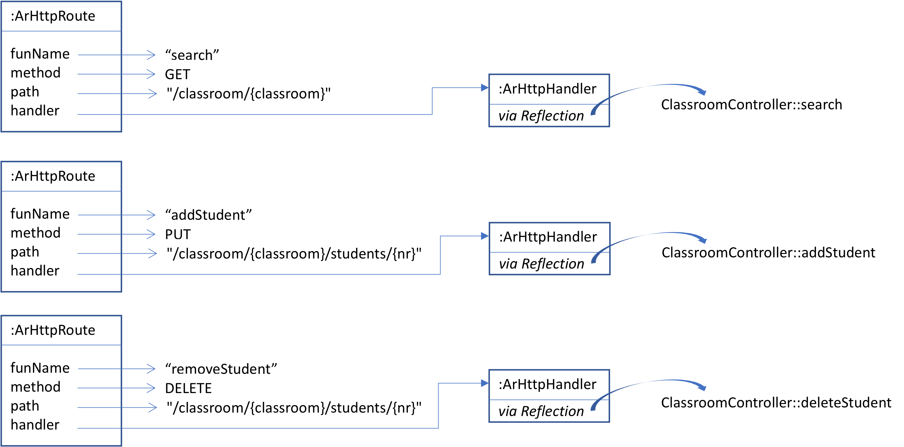
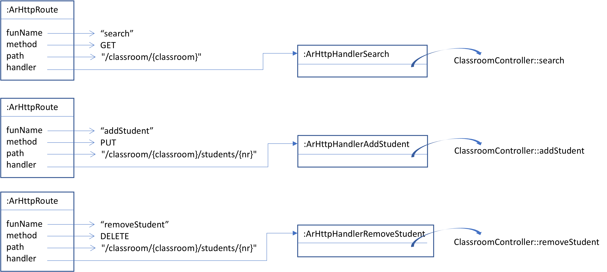

# Autorouter

Automatic HTTP handlers for a controller object with specific annotations.

## Assignment 1 - Types at runtime and Reflection API

The AutoRouter library allows the automatic creation of HTTP handlers for a 
[`pt.isel.autorouter.JsonServer`](autorouter/src/main/java/pt/isel/autorouter/JsonServer.java)
based on a router object with specific annotations, according to the next [example of `ClassroomController`](#classroomController-example).

All methods annotated with `@AutoRoute` and returning an `Optional` are eligible
for HTTP handlers.
To avoid ambiguity with existing types of JDK we choose to prefix annotations with `Ar`, i.e. `ArRoute`,
`ArQuery`, `ArBody`.

For simplicity, [`JsonServer`](autorouter/src/main/java/pt/isel/autorouter/JsonServer.java) 
is only responding with status codes of 200, 404, and 500, depending 
on whether the handler returns a fulfilled `Optional`, an empty `Optional` or an exception.
(you may consider the use of an alternative `Either`, or other type to enhance responses)

1. Implement the Java function `Stream<ArHttpRoute> autorouterReflect(Object controller)`, which builds
a stream of [`ArHttpRoute`](autorouter/src/main/java/pt/isel/autorouter/ArHttpRoute.java)
objects for each eligible method in given `controller` object parameter.

2. Implement another example of a controller object for a different domain, such as playlist,
movies, football teams, basket, moto gp, or any other of your choice. 
Implement the corresponding tests to validate that all routes generated with `autorouterReflect`
for your controller class are correctly invoked for each HTTP request.

The next figure shows the resulting stream of
[`ArHttpRoute`](autorouter/src/main/java/pt/isel/autorouter/ArHttpRoute.java) objects
for the example of a [`ClassroomRouter` instance](#classroomController-example).
The `autorouterReflect` can be used in Kotlin through a statement such as:

```kotlin
ClassroomRouter().autorouterReflect().jsonServer().start(4000)
```



#### ClassroomController example

```kotlin
class ClassroomController {
    /**
     * Example: http://localhost:4000/classroom/i42d?student=jo
     */
    @Synchronized
    @AutoRoute("/classroom/{classroom}")
    fun search(@ArRoute classroom: String, @ArQuery student: String?): Optional<List<Student>> {
        // ...
    }
    /**
     * Example:
     *   curl --header "Content-Type: application/json" \
     *     --request PUT \
     *     --data '{"nr": "7777", "name":"Ze Gato","group":"11", "semester":"3"}' \
     *     http://localhost:4000/classroom/i42d/students/7777
     */
    @Synchronized
    @AutoRoute("/classroom/{classroom}/students/{nr}", method = PUT)
    fun addStudent(
        @ArRoute classroom: String,
        @ArRoute nr: Int,
        @ArBody s: Student
    ): Optional<Student> {
        // ...
    }
    /**
     * Example:
     *   curl --request DELETE http://localhost:4000/classroom/i42d/students/4536
     */
    @Synchronized
    @AutoRoute("/classroom/{classroom}/students/{nr}", method = DELETE)
    fun removeStudent(@ArRoute classroom: String, @ArRoute nr: Int) : Optional<Student> {
        // ...
    }
}
```

## Assignment 2 - Dynamic Code Generator and Performance Evaluation with JMH

In this assignment, we follow a different approach to invoke the functions of a controller object.
Instead of using Reflection we will generate different implementations of `ArHttpHandler`
for each function in controller object, as denoted in the next figure.
Notice, these implementations (e.g. `ArHttpHandlerSearch`, `ArHttpHandlerAddStudent`, `ArHttpHandlerRemoveStudent`)
do not use reflection to call the methods of `ClassroomController`.

Implement the Java function `Stream<ArHttpRoute> autorouterDynamic(Object controller)`, which builds
a stream of [`ArHttpRoute`](autorouter/src/main/java/pt/isel/autorouter/ArHttpRoute.java)
objects for each eligible method in given `controller` object parameter.



## Benchmarking

### Usage

To run these benchmarks on you local machine just run:

```
./gradlew jmhJar
```

And then:

```
java -jar autorouter-bench/build/libs/autorouter-bench-jmh.jar -i 4 -wi 4 -f 1 -r 2 -w 2 
```

* `-i`  4 iterations
* `-wi` 4 warmup iterations
* `-f`  1 fork
* `-r`  2 run each iteration for 2 seconds
* `-w`  2 run each warmup iteration for 2 seconds.

### Results

|  |
|:---------------------------------------------------------:|
|            *Autorouter JMH BenchMark Results*             |

Below are the results of the benchmark for the different domains and approaches,
regarding the performance of each method compared to the baseline approach.

#### Domain Empty:

|     Method     | Approach | Performance |
|:--------------:|:--------:|:-----------:|
|   addStudent   | reflect  |    3.07     |
|   addStudent   | dynamic  |    1.08     |
| removeStudent  | reflect  |    3.57     |
| removeStudent  | dynamic  |    1.34     |
|     search     | reflect  |    5.88     | 
|     search     | dynamic  |    0.92     |

#### Domain Classroom:

|    Method     | Approach | Performance |
|:-------------:|:--------:|:-----------:|
|  addStudent   | reflect  |    2.45     |
|  addStudent   | dynamic  |    1.11     |
| removeStudent | reflect  |    3.39     |
| removeStudent | dynamic  |    1.07     |
|    search     | reflect  |    5.73     |
|    search     | dynamic  |    0.99     |

The **performance** is calculated as the ratio between the number of operations in ms of the baseline approach and the number of operations in ms of the current approach,
and represents the performance loss or gain of the current approach compared to the baseline approach of the current domain.

The results show
the **dynamic code** generation approach is **much faster** than the reflection approach in all methods of a given domain.

#### Authors

- Diogo Rodrigues - 49513
- Tiago Frazão - 48666
- Francisco Engenheiro - 49428

---

Instituto Superior de Engenharia de Lisboa<br>
BSc in Computer Science and Engineering<br>
Languages and Managed Runtimes<br>
Summer Semester of 2022/2023
